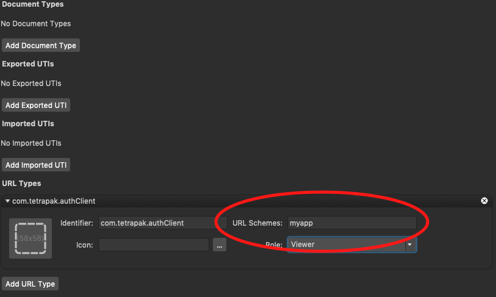
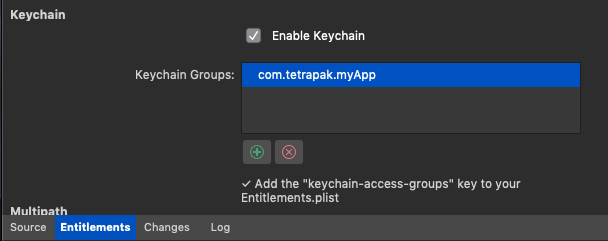
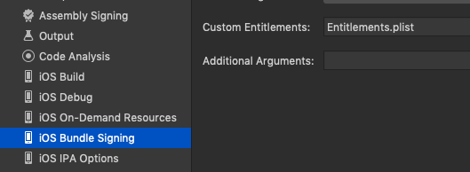

# TetraPak.Auth.Xamarin - TAX


## Introduction

The **TetraPak.Auth.Xamarin** package ("**TAX**" from here on) is tailor made for projects targeting [Tetra Pak APIs][tetra-pak-developer-portal] with a native client built with the Xamarin mobile app development platform. **TAX** is designed to take care of all details when authorizing the app for its intended back ends. All you need to do as a developer is provide a client id and a redirect URI and the packet takes care of the rest, utilizing the best-practices and policies currently recommended or required by Tetra Pak.

Please note that **TAX** is *not* a general purpose OAuth authorization solution. Its intended purpose is to provide everything you as a developer need to consume Tetra Pak APIs. Should you have a need to consume non-Tetra Pak APIs you will probably do better to look to more generic packages for OAuth2, such as [MSAL][NuGet-MSAL], [ADAL][NuGet-ADAL], or [Xamarin.Auth][NuGet-Xamarin-auth].

## The Authorization Flow

The TAX package implements the OAuth2 **Authorization Code Grant** flow. Here's how it goes:

1. The client (your app) requests an authorization code from a Tetra Pak authority (API endpoint).
2. The authority redirects the client to an identity service which challenges the end-user for her credentials. It is also possible that the end user will have to give her consent for the client to get access to her data.
3. When the end-user has been authenticated an authorization code (`authCode` from here on) is sent back to the client via a redirect (HTTP 301) response.
4. The client picks up the `authCode` and posts it to a token issuer (another API endpoint) requesting an Access Token.
5. The token issuer validates the request (the authorization code, the client id and a few other details also submitted) and if all looks good an `Access Token` is issued and sent back in the payload of the response. The response can also contain a `Refresh Token` and a token `expiration time`, expressed as how many seconds the `Access Token` token is valid for.

The client can now include the `Access Token` in all traffic to endpoints that acknowledge a Tetra Pak-issued token.

A crucial aspect of this flow is how your client never have access to the end user's credentials. The user authentication step (#2 in the flow) is involving only the end user and the identity service, which are the only entities in this flow that *should* have access to the user credentials.

During the request for user's credentials (item #2) the client submits its request to a process that runs with root privileges. On Android and iOS this is typically the *Chrome* and *Safari* web browser apps, respectively.

There's two aspects to this that are important: Firstly, as already mentioned, this means the client is not involved in, and therefore never "sees", any credentials. Secondly, the Identity Service might ask for a device-installed certificate as an alternative to the user's id and password. This is not only safer but also a more seamless user experience. But for it to work the running process needs access to the operating systems "secure store" (e.g. *KeyChain* in iOS/Mac OS and *KeyStore* in Android respectively) where such certificates are provisioned.

## The Token Refresh Flow

Eventually, the Access Token will expire. When that happens the client is faced with either starting the [The Authorization Flow](#the-authorization-flow) again or initiate a request for a new Access Token. The first option will very likely see the Identity Service challenging the end-user for her credentials again, possibly causing a disruptive user experience and frustration if done frequently, resulting in a poor user experience, followed by foul words and a tarnished reputation for your app!

If a `Refresh Token` was issued it can instead be used to initiate a separate, faster and simpler flow as there are no challenges or user interactions involved. It either works or fails:

1. Client POSTs a request for a new `accessToken` to the token issuer service. The POST contains both a `refreshToken` and the `clientId`.
2. Token Issuer validates the `refreshToken` request returns a new `accessToken` if all validates OK or a FAIL response if not.

Of course, if the Token Refresh Flow fails, which it will if the refresh token has expired or you send bad stuff to the Token Issuer, you're still left with initiating [the Authorization Flow](#the-authorization-flow) again.

## The TAX API Design

All of the above is taken care of by **TAX**. As a client dev all you need is this package, a `clientId`, a `redirectUri` and you're good to go.

**TAX** will perform the whole "dance" of acquiring tokens, authenticating the user and so on. Your code just makes the (asynchronous) request, `await` and when done will be served an `AuthResult` object to indicate success/failure. When successful the object also carries an `accessToken` and when unsuccessful it contains error details instead. The app never sees a `refreshToken` but there are ways for it to exploit them "silently" when available.

Please not that the accessToken you get should **NOT** be persisted anywhere in any form. Keep it in memory only! If you want to prevent memory scan attacks then go ahead and encrypt it but do not save it to the file system or a database on your device.

The **TAX** package was designed to remove all the C3s (Cross Cutting Concerns) from the authorization aspect that can be automated for you. Security-related best practices and recommendations changes over time so installing and using this package is a good way for any Tetra Pak client development team to get started quickly, knowing they are up to standards with security.

To authorize your app you have to perform these two steps:

1. Get an authenticator
2. Request an access token

### Obtain an Authenticator

The TAX API starts with the `IAuthenticator` interface. At the time of this writing there is just one class implementing it and you get the default implementation by calling: `Authorization.GetAuthenticator`. Let's look at a few ways to do that ...

```csharp
var clientId = "1234567";
var redirectUri = new Uri("myapp://auth");
var environment = RuntimeEnvironment.Development;
var authenticator = Authorization.GetAuthenticator(clientId, redirectUri, environment, Log);
```

In the above example you call `Authorization.GetAuthenticator`, describing your app with a `clientId`, your `redirectUri` and the environment (`RuntimeEnvironment`) you want the app to be authorized for. While this works fine, there are alternatives that might be better suited for scenarios where you might want to script or persist these details. The `AuthApplication` can be implicitly cast to/from a textual description (`string`), for easy serialization and scripting needs ...

```csharp
var myApp = (AuthApplication) "Development, 1234567, myapp://auth";
var authenticator = Authorization.GetAuthenticator(myApp, Log);
```

... or just:

```csharp
var authenticator = Authorization.GetAuthenticator("DEV, 1234567, myapp://auth", Log);
```

(You can find more details for [how the `AuthApplication` descriptor works here](#authapplication).)

The `Authorization.GetAuthenticator` method needs the passed in application descriptor (`AuthApplication`) to target the correct runtime environment, verify your app and to be able to communicate back the result for the authorization operation. When creating the descriptor you have to submit the `clientId` and `redirectUri` as a minimum. Omitting the runtime environment will default to `RuntimeEnvironment.Production`.

Finally, the last option for acquiring an authenticator is by providing a "configuration", as an alternative to an "application descriptor":

```csharp
var myApp = (AuthApplication) "Dev, 1234567, myapp://auth";
var config = AuthConfig.Default(myApp).WithScope("read", "write", "user-id");
var authenticator = Authorization.GetAuthenticator(config, Log);
```

This example instead initializes a default configuration, using an app descriptor, and submits it while obtaining an authenticator. This approach involves more steps but also allows for more control. Among other things specifying a configuration allows you to specify a custom scope, replace the default token cache mechanic and so on. Check out the [AuthConfig](#authconfig-class) section for more details.

### Request an Access Token

Having obtained an `IAuthenticator` you can now request an access token. There are two methods supporting this: `GetAccessTokenAsync` and `GetAccessTokenSilentlyAsync`. Let's discuss them separately ...

```csharp
var authorized = await authenticator.GetAccessTokenAsync();
if (authorized)
{
    this.AccessToken = authorized.Value.AccessToken;
}
else
{
    error($"Authorization failed with message: {authorized.Message}");
}
```

The `GetAccessToken` method returns a `BoolValue<AuthResult>` value. This value is type compatible with a `bool` value and, so, can be used directly in tests (note the `if (authorized)` test in the second code line above). The value then carries a `AuthResult` object as its value, which contains information about the authorization, including all tokens (if successful).

Unless the authenticator have a valid `accessToken` already ([cached]) this example will start a new authorization flow, which likely will have the Identity service challenge the user for her credentials. If a token was cached (and hasn't expired) you will simply retrieve it seamlessly. If you, for some reason, need to force a new access token, you can do so by passing a `false` value for optional the `allowCached` parameter:

```csharp
var authorized = await authenticator.GetAccessTokenAsync(false);
```

The authorization result might also pass a refresh token, which will automatically be cached (unless you turn off caching globally; see [AuthConfig](#authconfig-class). The refresh token, however, will not be used, regardless, when you call the `GetAccessTokenAsync` method. To allow the use for a renewed access token, instead invoke the alternative method: `GetAccessTokenSilentlyAsync`:

```csharp
var authorized = await authenticator.GetAccessTokenSilentlyAsync(false);
```

That will allow the authenticator to attempt a [refresh token flow](#the-token-refresh-flow) if no valid access token is available, which is a more seamless experience for the user as no credentials needs to be passed interactively.

---

NOTE

When you invoke the `IAuthenticator.GetAccessTokenAsync` or `IAuthenticator.GetAccessTokenSilentlyAsync` methods you might want to ensure this is done from the main (UI) thread to avoid unwanted behavior or hangs as the authorization flow might need to push a new view to work.

---

### Consume the Authorization Result

As the request for token(s) is completed the result is returned back to the client code as an `AuthResult` object. The result contains a collection of tokens, each represented by a `TokenInfo` object that carries the actual `TokenValue` (a `string`), the `Role` (a `TokenRole` enum) and a expiration time (`DateTime`) when applicable. You can iterate this collection or use LINQ to quickly find a token of interest, such as the access token, like so: 

```csharp
var accessToken = authResult.Tokens.FirstOrDefault(i => i.Roke == TokenRole.AccessToken);
```

Easier still; you can quickly get access to the token of interest through any of the `AuthResult` properties:  `AccessToken`, `RefreshToken` or `IdToken`.

### Token Validation

Before your client starts using a retrieved token it is recommended you validate it. The `TokenInfo` class offers an API for this as well: `Task<bool> IsValidAsync()`.

The (asynchronous) method `IsValidAsync()` will validate the token for you, possibly by invoking remote services in the process.

### Inspecting the identity token

To enable (mobile) backend access to the authorized user's identity you need to take one additional step when acquiring your access token. To enable user identity information just set the `AuthConfig.IsRequestingUserId` flag. Having done so TAX will automatically send a request for an identity token while requesting authorization. The result (`AuthResult`) should now support an identity token (`TokenInfo.Role == TokenRole.IdToken`). The ID token is of type [JWT][JWT-io].

As with an access token, please ensure you always validate the (JWT) ID token before consuming it (see [token validation](#token-validation))!

The JWT token you find in the `AuthResult.IdToken` is a base-64 encoded string. Rather than decoding and parsing the string you can instead instantiate a `JwtSecurityToken`, passing the encoded token as the constructor parameter. This requires the `System.IdentityModel.Tokens.Jwt` NuGet package. For more information about this class please refer to its [documentation][JwtSecurityToken].

## Scope

When authorizing you have the ability to specify a scope. In fact, this is what happens when you set the `AuthConfig.IsRequestingUserId` flag: The `AuthConfig.Scope` gets set to "openid". That is what generates the id token for you. The id token itself carries a basic set of claims, useful for identifying the authorized user. But setting the `AuthConfig.Scope` property directly allows for even more [user information](#user-information), such as the user's "profile", email, or which AD groups he/she is a member of.

## User Information

TAX supports the ability for clients to request information about the authorized user, including his/her profile information and which AD groups he/she is a member of.

To get this information you need first to have requested it. As a minimum an id token must have been requested, by setting the `AuthConfig.IsRequestingUserId`. This will provide you with a bare minimum of user information, such as the user's identity. By specifying an extended scope (by setting the `AuthConfig.Scope`) you can obtain more information.

The following example shows how to easily obtain user information, based on the authorization result:

```csharp
async Task<BoolResult<UserInformation>> authorizeAndGetUserInformation(AuthConfig authConfig, ILog log)
{
    authConfig.IsRequestingUserId = true;
    authConfig.Scope = $"{AuthScope.Profile} {AuthScope.Email} {AuthScope.Groups}";
    var authenticator = Authorization.GetAuthenticator(authConfig, log);
    var authorized = await authenticator.GetAccessTokenSilentlyAsync();
    if (!authorized)
        return BoolResult<UserInformation>.Fail();

    var authResult = authorized.Value;
    return authResult.TryGetUserInformationAsync();
}
```

## Getting Started

As a client developer, you need to do the following:

1. Download and install the ["TetraPak.Auth.Xamarin" NuGet package][NuGet.TAX].
2. Acquire a `clientId` for your app. You do this by registering your app with the [Tetra Pak developer portal][tetra-pak-developer-portal]
3. Decide upon a `redirect URI` and register it for your app.
4. Initialize each platform project (iOS/Android/UWP) to collaborate with TAX's authorization flows.

Step #1 - how to register an new app with the [Tetra Pak developer portal][tetra-pak-developer-portal] - will not be covered in this document. The details for that might change over time so please refer to the documentation provided by the dev-portal instead.

Steps #2 and #3 will be covered separately per platform in the following sections ...

### Register a Custom URL Scheme - iOS

In Visual Studio, in your iOS project, open the `info.plist` file and navigate to the "Advanced" tab. Under **URL Types** click **Add URL Type** and fill in the **URL Schemes** with the scheme you registered with the [Tetra Pak developer portal][tetra-pak-developer-portal]:



### Initiate the App - iOS

To allow your iOS to collaborate with TAX you need to add two lines of code, both in the `AppDelegate` class:

```csharp
public override bool FinishedLaunching(UIApplication app, NSDictionary options)
{
    global::Xamarin.Forms.Forms.Init();
    LoadApplication(new App());
    TetraPakAppDelegate.OnFinishedLaunching(app, options); // <-- add this
    return base.FinishedLaunching(app, options);
}

public override bool OpenUrl(UIApplication app, NSUrl url, NSDictionary options)
{
    return TetraPakAppDelegate.OnOpenUrl(app, url, options); // <-- and this
}
```

Firstly, in the `AppDelegate` class, add a call to `TetraPakAppDelegate.OnFinishedLaunching` passing on the the values passed in by iOS.

Secondly, override the `AppDelegate.OpenUrl` method and add pass the provided values on `TetraPakAppDelegate.OnOpenUrl`.

In iOS, to allow **TAX** to safely persist your refresh token, you need also to add the "KeyChain" Entitlement.

- Open the `Entitlements.plist` file (editor)
- Click the "+" button under the **Keychain** section.
- Add an identifier to be used to identify your items in the iOS Keychain.



- Ensure the `Entitlements.plist` file is selected as the **Custom Entitlements** value in the app's project options, under the **iOS Bundle Signing**:



### Register a Custom URL Scheme - Android

In Android, this is done a bit different, through a custom `Activity` which you attribute as the entry point for all attempt to "open" resources with your custom URL scheme in their resource locator (URL). Here's how to do it:

In your Android platform project, add a new `Activity` class:

```csharp
[Activity(Label = "MyAuthActivity")]
[IntentFilter(
    actions: new[] { Intent.ActionView },
    Categories = new[] { Intent.CategoryDefault, Intent.CategoryBrowsable },
    DataSchemes = new[] { "myapp" }, // <-- custom URL scheme
    DataPath = "/auth"               // <-- anything you prefer
)]
public class AuthActivity : Activity
{
    protected override void OnCreate(Bundle savedInstanceState)
    {
        base.OnCreate(savedInstanceState);
        TetraPakAuthActivity.OnCreate(this, Intent);
    }
}
```

This new `Activity` will be called by Android when the Authority redirect your requested `authCode`. Calling `TetraPakAuthActivity.OnCreate(this, Intent)` will automatically extract the `authCode` and allow **TAX** to proceed to the final step, requesting your `accessToken`.

### Register a Custom URL Scheme - UWP

UWP apps takes an approach that is similar to iOS, in how you declare your custom URL scheme in the app's "Package.appmanifest" file. A custom URL schemes are called a *Windows protocol* in UWP apps.

Open the `Package.appmanifest` file in an editor (or your IDE) and add a new tag under the `<Extensions>` tag:

```xml
<Applications>
<Application Id="App"
    Executable="$targetnametoken$.exe"
    EntryPoint="myApp.uwp.App">
    :
    <Extensions>
    <uap:Extension Category="windows.protocol">
        <uap:Protocol Name="myapp">  <!-- custom URL scheme -->
            <uap:DisplayName>MyApp</uap:DisplayName>
        </uap:Protocol>
    </uap:Extension>
    </Extensions>
</Application>
</Applications>
```

## Customization

The **TAX** library is designed to allow very easy integration for any Xamarin-based Tetra Pak client with a minimum of configuration. This allows for automatic adherence to Tetra Pak recommendations and policies while keeping apps as forward compatible as possible. As recommendations, policies or infrastructure change a new package can easily be distributed to replace the current one for existing apps. Most parameters, such as endpoints, are provided as default values and can usually be left untouched.

For unforeseen situations or test-scenarios, however, it may become convenient or even necessary to provide custom values for these attributes. For this reason the client can provide its own custom configuration through the `AuthConfig` class.

Rather than obtaining a default authenticator [like already described](#obtain-an-authenticator) the client can create a custom `AuthConfig` object and pass it to the `Authorization` API:

```csharp
var config = new AuthConfig(
    new Uri("https://localhost:5050/authorize"),
    new Uri("https://localhost:5050/token"),
    new Uri("myapp://auth"),
    "1234-9876",
    "",
    isPkceUsed: false,
    isCaching: false
    );
var authenticator = Authorization.GetAuthenticator(config, Log);
```

The `AuthConfig` class also supports a fluent API through the `AuthConfigExtensions` class. Here's a few examples:

```csharp
var config = AuthConfig.Default(RuntimEnvironment.Development, "1234-9876", new Uri("myapp://auth"))
    .WithAuthority(new Uri("https://localhost:5050/authorize"))
    .WithTokenIssuer(new Uri("https://localhost:5050/token"))
    .WithTokenCache(new MyTokenCache());
var authenticator = Authorization.GetAuthenticator(config, Log);
```

## Appendix

Hopefully, the above documentation was enough to get you started consuming the Tetra Pak Authorization APIs. If you're the curious sort of organism, however, the following few sections might be worth a read.

### `RuntimeEnvironment` (enum)

The `RuntimeEnvironment` is an `enum` supporting these values:

```csharp
/// <summary>
///   Targets a production environment.
///   Allowed Mnemonic: "PRD" or "PROD".
/// </summary>
Production,

/// <summary>
///   Targets a migration environment.
///   Allowed Mnemonic: "MIGR" or "MIG".
/// </summary>
Migration,

/// <summary>
///   Targets a development environment.
///   Allowed Mnemonic: "DEV" or "DEVL".
/// </summary>
Development,

```

When expressing a `RuntimeEnvironment` value it is possible to use the mentioned mnemonic identifiers. The mnemonics are case-insensitive.

### `Authorization` (class)

A static class that provides a starting point for authorization. See [how to obtain a `IAuthenticator`](#obtain-an-authenticator) and acquire an access token.

### `AuthApplication` (class)

Describes an application to be authorized. The type can be expressed in textual format: "`[<Platform>]; <Environment>; <Client Id>; <Redirect Uri>`". This class is used to easily describe your application to allow the `Authorization` API to configure a `IAuthenticator` as you request it.

### `AuthConfig` (class)

Used to configure a `IAuthenticator` used for acquiring access tokens. The **TAX** system can create this configuration behind the scene if you describe your application using the more simplified [`AuthApplication`](#authapplication-class) class when invoking [`Authorization.GetAuthenticator`](#obtain-an-authenticator) but an `AuthConfig` allows for more [custom configuration](#customization)

### `AuthScope` (class)

Represents supported OAuth/OIDC scopes. The class itself carries a set of useful/well known identifiers as `string` constants, such as:
- `OpenId`
- `Profile`
- `Email`
- `Groups`

A scope value can be expressed as a string, using whitespace for separating multiple scope identifiers:

```csharp
void setScope(AuthConfig config)
{
    config.Scope = "openid profile groups";
}
```

Another option, is to use the `AuthScope` constructor:

```csharp
void setScope(AuthConfig config)
{
    config.Scope = new AuthScope(AuthScope.Openid, AuthScope.Profile, AuthScope.Groups);
}
```

To examine an `AuthScope` value, you can use its `Items` property:

```csharp
void presentScope(AuthConfig config)
{
    foreach (var scopeIdentifier in onfig.Scope.Items)
    {
        Console.WriteLine(scopeIdentifier);
    }
}
```

In many situations it might be useful to know (and present) which scope identifiers are actually supported by the Tetra Pak Login API. This information is available through the `AuthScope.Supported` property (a `string` array). Please note that this property is simply a convenient API for the `DiscoveryDocument.ScopesSupported`. For it to be reliable, please ensure the discovery document is updated (see [DiscoveryDocument](#discoverydocument-class)).

### `DiscoveryDocument` (class)

This class represents a discovery document obtained from a well-known OIDC endpoint. After authorization, and [requesting an id token](#inspecting-the-identity-token), TAX will automatically attempt fetching an updated discovery document and cache it locally. You can obtain the discovery document through the `DiscoveryDocument.Current` property. When unavailable you can retrieve a new document by invoking the `static DownloadAsync` method, passing either an id token or the actual discovery endpoint as input, like so:

```csharp
async Task<DiscoveryDocument> getDiscoveryDocument(AuthResult authResult, bool forceRefresh = false)
{
    if (authResult is null)
        throw new ArgumentNullException(nameof(authResult));
    if (authResult.IdToken is null)
        throw new InvalidOperationException("Cannot obtain discovery document without an id token");

    var downloaded = await DiscoveryDocument.DownloadAsync(authResult.IdToken);
    if (downloaded)
        return downloaded.Value;

    throw new Exception("Failed to obtain a discovery document");
}
```

For more information about the discovery document, please refer to the class documentation provided by the TAX package in your IDE.

### Token Caching

**TAX** provides a default token cache (of class `TokenCache`) for the `AuthConfig` object passed when [obtaining the Authenticator](#obtain-an-authenticator). Unless you specifically turn caching off (`AuthConfig.IsCaching`) the token cache till retain any access tokens in memory and persist refresh tokens in the OS's "secure store" (KeyChain for iOS/Mac OS and Keystore for Android).

This implements Tetra Pak's recommendations to never persist access tokens while allowing for a convenient user experience. As the app gets terminated the access token will be lost but a new one can easily be obtained without involving the user by invoking the "silent" alternative:

```csharp
var authorized = await authenticator.GetAccessTokenSilentlyAsync();
```

Should the default token cache implementation not be sufficient for your needs you can easily replace it when configuring authorization:

```csharp
var config = AuthConfig.Default(myApp).WithTokenCache(new MyTokenCache());
```

### How The Redirect Really Works

In steps #3 and #4 the Authority service sends back the `authCode` via a HTTP redirect (status code 301). The reason this happens is because the client is currently not involved, remember? As already mentioned, what actually happens in step #1 is the client hands over the actual request to an external process (typically the OS's default web browser) that takes care of the whole "dance" of being redirected to the identity server, rendering a login form, handling a consent form and so on.

So, when the `authCode` comes back there needs to be a way for the operating system to hand back the control (and `authCode`) to your client. Since you're obviously writing a native app (otherwise this document is pretty moot ;-) ) you have no way to intercept a normal HTTP response so a redirect is what needs to happen.

So, how do you intercept the redirect then? Basically, you can do this in two ways: Set up a HTTP listener or register a *custom URL scheme*.

The first option - launching a HTTP listener - would work but you would very likely have to run under root privileges for it to work. Depending on the OS there might be other policies enforced as well. It works but it would introduce quite the list of new C3s to handle.

The second option - registering a *custom URL scheme* simply means your client registers it's own URL scheme, such as `my-app` or `redirect-here`. This is also called "deep linking" and is a common mechanism in many operating systems for intra-process communication. For example, if you just tell the OS to "open" an arbitrary URL, such as `http://acme.com/hunting/traps?prey=roadrunner`, the OS checks the scheme (`http`) and looks up the app that is currently registered to handle that scheme; in this case the default web browser.

So, what happens in step #1 is basically the client builds its URL and sends it to the OS, which opens the default web browser who then performs the whole authorization code part of the "dance". In this URL is a property, such as `redirect_uri=my-app://auth-code-here-please` which is where the Authority will be redirecting to in step #3. Obviously, the web browser have zero clue as to what sort of URL scheme it's looking at (`redirect_uri=my-app`) so it gives up and sends the request to the OS, which then sends it to your app.

[tetra-pak-developer-portal]: https://developer.TetraPak.com
[NuGet-MSAL]: https://www.NuGet.org/packages/Microsoft.Identity.Client
[NuGet-ADAL]: https://www.NuGet.org/packages/Microsoft.IdentityModel.Clients.ActiveDirectory
[NuGet-Xamarin-auth]: https://www.NuGet.org/packages/Xamarin.Auth
[NuGet.TAX]: https://www.nuget.org/packages/TetraPak.Auth.Xamarin/
[GitHub-TAX-issues]: https://github.com/Tetra-Pak-APIs/TetraPak.Auth.Xamarin/issues
[NuGet-Xamarin-auth]: https://www.NuGet.org/packages/Xamarin.Auth
[JWT-io]: https://jwt.io/
[JwtSecurityToken]: https://docs.microsoft.com/en-us/dotnet/api/system.identitymodel.tokens.jwt.jwtsecuritytoken
